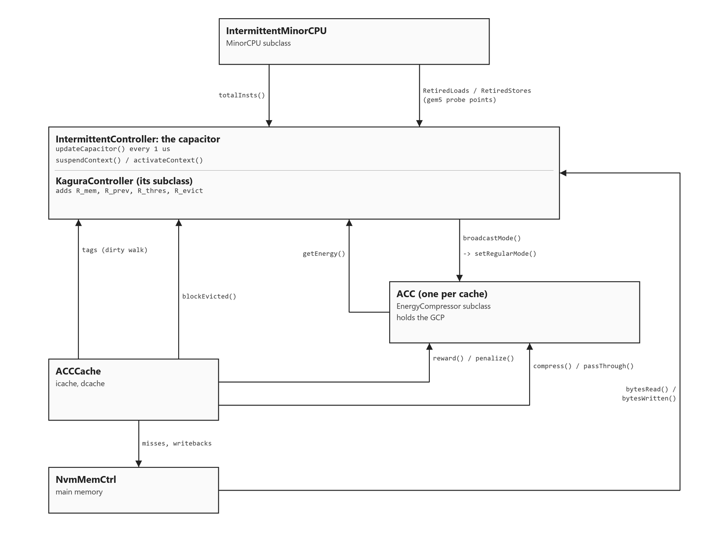

# Kagura

A gem5 reproduction of *Intermittence-Aware Cache Compression* (HPCA 2026),
built on gem5 v25.1.0.1.

The machine here has no battery. It scavenges whatever energy it can from its
surroundings into a capacitor, runs until the capacitor is empty, saves its
state, and dies. Then it waits to be charged again and picks up where it left
off. A program does not run once on a chip like this; it runs in pieces, with
power failures in between.

Cache compression is a good fit at first glance. The cache holds more, so there
are fewer trips to main memory, and there is less dirty data to save when the
power goes. But compressing a block is not free, and there is only one place
the energy can come from: the same capacitor that is keeping the program alive.

That is the tension the paper is about. Its argument is that compression should
be switched off near the end of a power cycle. A block compressed just before a
failure is thrown away with the rest of the SRAM. You paid for it and got
nothing back.

To test any of that, gem5 needs three things it does not have: a capacitor that
can run out, a compressor that costs joules instead of only cycles, and the two
policies themselves. All of it is in `src/ehs/`.

This is a fork, so gem5's own README is kept unchanged at
[README-gem5.md](README-gem5.md).

---

## The object graph

Seven SimObjects, connected by the config scripts in `configs/kagura/`. The
main path runs from the CPU down to memory. The controller sits on the side
and reads from everything:



The picture is generated by [`docs/kagura/objects_diagram.py`](docs/kagura/objects_diagram.py),
so it can be edited and redrawn instead of hand-patched.

Every arrow in the picture, written out. "What passes" is the actual call or
probe that carries the information:

| From | To | What passes |
|---|---|---|
| `IntermittentMinorCPU` | `IntermittentController` | `totalInsts()`, for dynamic energy |
| `IntermittentMinorCPU` | `KaguraController` | `RetiredLoads` / `RetiredStores` probes, one per committed memory op |
| `KaguraController` | `ACC` (both caches) | `broadcastMode()` -> `setRegularMode()` |
| `ACC` | `IntermittentController` | `getEnergy()`, a running total the controller differentiates |
| `ACCCache` | `ACC` | `reward()` / `penalize()` on every hit to a compressed block |
| `ACCCache` | `ACC` | per-fill flags: did this miss serve a store, and at what vaddr |
| `ACCCache` (dcache) | `KaguraController` | `blockEvicted()`, which is what AIMD tunes on |
| `ACCCache` tags | `IntermittentController` | the dirty-block walk at checkpoint (`ckpt_tags`) |
| `NvmMemCtrl` | `IntermittentController` | `bytesRead()` / `bytesWritten()` |
| `IntermittentController` | `IntermittentMinorCPU` | `suspendContext()` / `activateContext()` |

Two loops run over this graph.

**The energy loop, every 1 us.** `updateCapacitor()`
([`intermittent_controller.cc:87`](src/ehs/intermittent_controller.cc:87))
reschedules itself every 1000 cycles of a 1 GHz clock
([`:83`](src/ehs/intermittent_controller.cc:83),
[`:126`](src/ehs/intermittent_controller.cc:126)). Each tick it adds harvested
energy, subtracts consumed energy, turns the stored energy into a voltage, and
compares that against `v_off` and `v_on`.

**The power cycle, driven from Python.** The controller cannot stop a
pipelined CPU at an arbitrary moment. If it suspends a thread that still has
instructions in flight, they reach commit with the thread already suspended and
MinorCPU calls `panic()`
([`cpu/minor/execute.cc:970`](src/cpu/minor/execute.cc:970)). So a power
failure is a handshake with the config script:

```
updateCapacitor() sees V <= v_off
        |
        +-> freezeCpu() -> exitSimLoop("power failure")    [controller]
                |
                +-> m5.drain()                             [config]
                    root.intermittent.powerOff()           [controller]
                    m5.memWriteback(root)                  [config]
                    m5.memInvalidate(root)                 [config]
                        |
                        +-> m5.simulate() resumes, core dark
                            updateCapacitor() sees V >= v_on
                                |
                                +-> thawCpu()              [controller]
```

`powerOff()` has to run before `memWriteback()`. It prices the checkpoint by
counting dirty blocks, and `memWriteback()` clears each dirty bit as it saves
the block. Counting afterwards would always find nothing.

### One D-cache store, end to end

Both policies act only at a fill, so one store that misses is enough to touch
the whole graph:

1. The store misses in `ACCCache::access()`. An MSHR records it and the
   request goes over the membus to `NvmMemCtrl`. The capacitor reads the
   memory controller's byte counters at the next 1 us tick.
2. The response comes back to `ACCCache::recvTimingResp()`. It reads the MSHR
   first (was this a store, what virtual address), sets flags on the
   compressor, then lets `Cache::recvTimingResp()` do the fill.
3. The fill calls `ACC::compress()`. It goes down the priority ladder (hint,
   Kagura override, GCP, sampler) and either runs BDI or stores the block
   full size. A BDI run is counted, and the capacitor pays for it at the next
   `getEnergy()` poll.
4. If BDI halved the block, the tags can put it into one half of a superblock,
   next to another compressed block. Every later hit to it in `access()`
   rewards the GCP with the miss penalty. If the block ended up alone, the
   hit paid decompression latency for nothing, and the GCP is penalized
   instead.
5. When the block is evicted, `evictBlock()` reports it to `KaguraController`.
   AIMD uses that count to retune `R_thres` at the next reboot.

The same store also fired the `RetiredStores` probe into `memOpCommitted()`,
so `R_mem` moved one step closer to the decision point. One instruction is
both a fill request and one count toward turning compression off.

---

## `IntermittentController`: the capacitor

[`intermittent_controller.hh`](src/ehs/intermittent_controller.hh),
[`.cc`](src/ehs/intermittent_controller.cc), 490 lines

A `ClockedObject` built around one number, `storedEnergy`. Everything else is
bookkeeping.

### Energy in

`getHarvestPower()` ([`:183`](src/ehs/intermittent_controller.cc:183)) returns
either a synthetic square wave (`p_harvest`, `harvest_period`, `duty_cycle`) or
a sample from a loaded trace. `loadTrace()`
([`:131`](src/ehs/intermittent_controller.cc:131)) parses `time_s power_W`
pairs, rejects non-monotonic times and negative powers, and scales them by
`trace_scale`. The scale factor lets one measured harvest profile serve
several power regimes.

### Energy out

`getConsumePower()` ([`:215`](src/ehs/intermittent_controller.cc:215)) adds up
four terms:

| Term | Source |
|---|---|
| static | `p_static`, constant while powered |
| dynamic | `cpu->totalInsts()` delta x `e_per_inst` |
| compression | sum of `compressor->getEnergy()` deltas over the `compressors` vector |
| NVM traffic | `nvm->bytesRead()` / `bytesWritten()` deltas x per-byte energies |

Each term is read as a delta since the last 1 us tick, then divided by `dt` to
get an average power over the interval
([`:259-261`](src/ehs/intermittent_controller.cc:259)). This is why the
compressors and the memory controller only need to expose running totals: the
controller does the differentiating itself.

Two details. The compression and NVM accounting runs before the
`if (!powered) return 0.0` guard
([`:252`](src/ehs/intermittent_controller.cc:252)), so traffic during the off
period is still counted, and it lands in the `nvmBytesOffPeriod` /
`nvmEnergyOffPeriod` stats. And NVM energy only drains the capacitor when
`nvm_energy_to_capacitor` is set
([`:248`](src/ehs/intermittent_controller.cc:248)). It is always measured;
whether it competes with the program for charge is a sweep axis.

### The checkpoint

`countDirtyBytes()` ([`:282`](src/ehs/intermittent_controller.cc:282)) walks
every tag store in `ckpt_tags` with `forEachBlk`, skips blocks without
`CacheBlk::DirtyBit`, and adds up the rest. A compressed block is charged its
`getSizeBits()`, a plain block a full line. The configs only list the D-cache:
instruction fills are never written, so no I-cache block is ever dirty.

`powerOff()` ([`:362`](src/ehs/intermittent_controller.cc:362)) is the whole
checkpoint: optionally run the probe compressor, count the dirty bytes, add
`ckpt_reg_bytes` for architectural state, price the total at `e_per_byte_nvm`,
subtract it from `storedEnergy`, recompute the voltage, and suspend the CPU.
If the checkpoint costs more than what is left, it warns instead of losing
state silently ([`:375`](src/ehs/intermittent_controller.cc:375)). `v_off`
exists to leave enough charge to finish the checkpoint, so that warning means
`v_off` is set too low for this checkpoint size.

`probeDirtyBlocks()` ([`:308`](src/ehs/intermittent_controller.cc:308)) is
kept separate on purpose. It runs a compressor over the dirty set to ask what
the checkpoint would compress to. That compressor is not attached to any cache
and not wrapped in an `EnergyCompressor`, so it cannot touch the capacitor or
the energy ledger.

---

## `IntermittentMinorCPU`

[`intermittent_minor_cpu.cc`](src/ehs/intermittent_minor_cpu.cc), 36 lines

The smallest object here, and it exists for one line that is *not* in it.
Stock `MinorCPU::drainResume()` wakes every suspended thread. Every power
cycle resumes from a drain, so that would power the core back up in the middle
of an outage. The override copies the body and drops the wakeup loop
([`:18-34`](src/ehs/intermittent_minor_cpu.cc:18)). The decision to wake stays
where it belongs, in `IntermittentController::thawCpu()` at `v_on`.

It also gives the controller and Kagura the two things they read from the CPU:
`totalInsts()` for dynamic energy, and the `RetiredLoads` / `RetiredStores`
probes that `MinorCPU` fires once per committed memory operation.

---

## `NvmMemCtrl`

[`nvm_mem_ctrl.cc`](src/ehs/nvm_mem_ctrl.cc), 26 lines

A `MemCtrl` with two accessors for counters `MemCtrl` already keeps:

```cpp
uint64_t NvmMemCtrl::bytesRead()    const { return stats.bytesReadSys.value(); }
uint64_t NvmMemCtrl::bytesWritten() const { return stats.bytesWrittenSys.value(); }
```

It behaves exactly like a stock `MemCtrl`. It exists because main-memory
traffic is the largest energy term in this system, and the one compression is
supposed to reduce. A model that charges for compression but not for the
traffic compression avoids would be unfair to compression from the start.

---

## `EnergyCompressor`: pricing compression

[`energy_compressor.hh`](src/ehs/energy_compressor.hh),
[`.cc`](src/ehs/energy_compressor.cc), 150 lines

A `compression::Base` that wraps another compressor (always BDI here) and adds
two things gem5 has no concept of: a cost in joules, and a decision about
whether to compress at all.

`setCache()` ([`:29`](src/ehs/energy_compressor.cc:29)) forwards to the
wrapped compressor as well as to the base, so both are bound to the same
cache.

### The two outcomes

Every fill ends in one of two calls.

`runCompressor()` ([`:38`](src/ehs/energy_compressor.cc:38)) rebuilds the
cache line from chunks, gives it to the wrapped compressor's public
`compress()`, records the size it got back, and increments `compressionsRun`.

`passThrough()` ([`:77`](src/ehs/energy_compressor.cc:77)) sets the size to
`blkSize * 8` bits and both latencies to zero. This matches a failed
compression on purpose: the block is stored full size, pays no decompression
latency, and can never co-allocate. Nothing downstream has to tell "we chose
not to compress" apart from "compression did not help".

### Energy

`getEnergy()` ([`:123`](src/ehs/energy_compressor.cc:123)) is the whole cost
model:

```cpp
return energyStats.compressionsRun.value() * energyPerCompression +
       stats.decompressions.value() * energyPerDecompression;
```

`compressionsRun` counts compressions that actually ran. gem5's inherited
`compressions` stat counts attempts, which is not the same thing.
Decompressions come from the base class; the cache charges one on every hit to
a compressed block.

### Two policy hooks

`dirtyOverride()` ([`energy_compressor.hh:77`](src/ehs/energy_compressor.hh:77))
is `dirtyAware && fillServesWrite`. It lets a fill through a Regular Mode gate
when the fill serves a store. The reasoning: a block about to become dirty is
a block the checkpoint will have to write, so compressing it still pays.

`hintSaysSkip()` ([`energy_compressor.hh:95`](src/ehs/energy_compressor.hh:95))
tests the fill's virtual address against `[sw_hint_lo, sw_hint_hi)`. It is a
software compressibility hint with no lookup cost and no mispredicts, so a run
with it set is an upper bound on what any real hint could do.

Both need per-fill information the compressor interface cannot carry.
`ACCCache` supplies it with flags set around the base call, described below.

---

## `ACC`: the published baseline

[`acc.hh`](src/ehs/acc.hh), [`.cc`](src/ehs/acc.cc), 139 lines

Adaptive Cache Compression (Alameldeen & Wood, ISCA 2004), written as an
`EnergyCompressor` subclass. One saturating counter, the Global Compression
Predictor, adds up the net cycles compression has saved, and gates the wrapped
compressor:

```cpp
bool compressionEnabled() const { return gcp > 0; }   // acc.hh:91
```

`gcp > 0` is Compression Mode. Anything else is Regular Mode.

### The decision, in priority order

`ACC::compress()` ([`acc.cc:54`](src/ehs/acc.cc:54)) is the most important
control path in this code. Five outcomes, checked in this order:

| # | Test | Result |
|---|---|---|
| 1 | `hintSaysSkip()` | `passThrough`. The software hint outranks everything |
| 2 | `kaguraRegular && !dirtyOverride()` | `passThrough`, counted as `kaguraGatedCompressions` |
| 3 | `compressionEnabled()` | `runAndScore`, normal Compression Mode |
| 4 | sampler: `++gatedSinceSample >= sampleInterval` | `runAndScore`, counted as `sampledCompressions` |
| 5 | otherwise | `passThrough`, counted as `gatedCompressions` |

Kagura's override is checked before the sampler (line 65 against line 80). So
a Kagura run also suppresses the forced sampling compressions, not just the
ordinary ones. `mSAMP.sh` exists to measure what that is worth.

One more thing to know here: `ACC::compress()` overrides
`EnergyCompressor::compress()` without calling it. Steps 1 and 2 are written
out again instead of inherited, so those two predicates appear in both files.

### Why step 4 exists

A gated fill is stored full size, so it can never co-allocate, so it can never
produce a reward. Without step 4 the predictor would enter Regular Mode once
and stay stuck at its floor forever. The original design does not have this
problem: it runs the compressor on every allocation whether or not it stores
the result, so the computed size keeps feeding its avoidable-miss test for
free. gem5's tags do not work that way. `sample_interval` is this
reproduction's addition, and it is labelled as one everywhere it appears.

### Scoring

`runAndScore()` ([`acc.cc:31`](src/ehs/acc.cc:31)) runs the compressor and, if
`failed_penalty` is set, debits the GCP when the result comes back full size.
The published design needs no such penalty: it always pays compression cost,
so the cost is a constant that cancels out, and incompressible data simply
stops earning rewards. `failed_penalty` defaults to 0, which is the published
behaviour.

`reward()` and `penalize()` ([`:91`](src/ehs/acc.cc:91),
[`:105`](src/ehs/acc.cc:105)) saturate at `gcp_max` and `gcp_min`, and count a
`modeSwitch` whenever `compressionEnabled()` flips.

---

## `ACCCache`: feeding the predictor

[`acc_cache.hh`](src/ehs/acc_cache.hh), [`.cc`](src/ehs/acc_cache.cc),
141 lines

The predictor lives in the compressor, but the compressor is called from a
non-virtual path in `BaseCache` and cannot see hits. `access()` is virtual, so
a thin `Cache` subclass can see them. That is all this class is for.

### Classifying hits

`access()` ([`acc_cache.cc:99`](src/ehs/acc_cache.cc:99)) calls
`Cache::access()` and then looks at the block on a hit:

```cpp
if (cblk->isCompressed()) {
    if (superblock->getNumValid() > 1)  acc->reward(currentReward());
    else                                acc->penalize(cblk->getDecompressionLatency());
}
```

Co-allocated: the block shares its superblock with another valid block. The
extra capacity from compression is what is holding it, so without compression
this hit would have been a miss. Credit the miss penalty.

Alone: the block would have fit anyway, and the access still paid
decompression latency for nothing. Debit exactly that latency, read from the
block itself.

Hits to uncompressed blocks say nothing about compression, so they leave the
GCP alone.

### Pricing the reward

`currentReward()` ([`:63`](src/ehs/acc_cache.cc:63)) returns either the
configured constant or, when `reward_cycles < 0`, a measured value:

```
reward = max(round(avgMissPenalty in cycles) - hitCycles, 0)
hitCycles = sequentialAccess ? lookup + data : max(lookup, data)
```

The miss penalty is sampled in `recvTimingResp()`
([`:28`](src/ehs/acc_cache.cc:28)) as
`curTick() - target->recvTime + responseLatency`, added up over every
response, and reported as `avgMissPenaltyTicks` so any run can be checked
later. Measuring instead of fixing matters in a sweep: the miss penalty
depends on the machine (geometry, workload, queueing), so a constant
calibrated at one sweep cell is wrong at every other one, and two rows would
then differ by their calibration instead of by the policy under test.

### The bracket pattern

`compress()` cannot take extra arguments, so per-fill facts reach the
compressor as flags set around the base call
([`:45-59`](src/ehs/acc_cache.cc:45)):

```cpp
acc->setFillServesWrite(mshr->needsWritable());   // was this miss a store?
acc->setFillVaddr(vaddr, have_vaddr);             // for the software hint
Cache::recvTimingResp(pkt);                       // fill happens in here
acc->setFillServesWrite(false);                   // clear
acc->setFillVaddr(0, false);
```

The MSHR is the record of the outstanding miss, and the base call destroys it.
So everything needed from it is read first. The virtual address comes from the
MSHR's target packet; the response does not carry one.

### Reporting evictions

`evictBlock()` ([`:89`](src/ehs/acc_cache.cc:89)) calls
`kagura->blockEvicted()` before handing over to `Cache::evictBlock()`. This is
the only place evictions can be seen, and it is where Kagura's AIMD gets its
input. The configs set `kagura` on the D-cache only.

---

## `KaguraController`: the paper's policy

[`kagura_controller.hh`](src/ehs/kagura_controller.hh),
[`.cc`](src/ehs/kagura_controller.cc), 316 lines

An `IntermittentController` subclass. Same capacitor and checkpoint model,
plus five registers and a 2-bit counter:

| Register | Meaning |
|---|---|
| `R_mem` | memory operations committed so far this power cycle |
| `R_prev` | the previous cycle's count, corrected |
| `R_thres` | the threshold at which compression gets disabled |
| `R_evict` | blocks evicted since the decision point |
| `R_adjust` | the learned correction, `R_mem - R_prev` |
| `satCounter` | 2-bit confidence in the estimate |

ACC asks: is compression gaining anything? Kagura asks the question ACC
cannot: will this block live long enough to gain anything at all?

### Counting

`regProbeListeners()` ([`:58`](src/ehs/kagura_controller.cc:58)) connects to
the CPU's `RetiredLoads` and `RetiredStores` probes. The registers sit
conceptually at the LSQ; the commit probes are the closest observation point
gem5 offers.

### The decision point

`memOpCommitted()` ([`:78`](src/ehs/kagura_controller.cc:78)) runs once per
committed memory op:

```cpp
const int64_t nRemain = int64_t(rPrev) - int64_t(rMem);
if (nRemain <= int64_t(rThres)) { ... regularMode = true; broadcastMode(true); }
```

`nRemain` is signed, because the current cycle can outrun the previous one.
`broadcastMode()` ([`:71`](src/ehs/kagura_controller.cc:71)) calls
`setRegularMode(true)` on every compressor in the vector, including the
I-cache's. That matters: Kagura's trigger is the power-cycle countdown, not
decompression evidence, so it can act on a cache ACC never gates.

Two optional vetoes can block the transition
([`:107-110`](src/ehs/kagura_controller.cc:107)): a confidence floor
(`rm_confidence_min`) and a perceptron over the history of cycle outcomes
(`rm_perceptron`). Both default to off, which is the published behaviour. Once
a veto fires, `gateBlocked` skips the check for the rest of the cycle:
`satCounter` only moves at power-off, so the verdict cannot change before
then.

### At power-off

`powerOff()` ([`:147`](src/ehs/kagura_controller.cc:147)) computes
`R_adjust = R_mem - R_prev` and scores the estimate: within `closeness_frac`
of `R_prev` the counter goes up, otherwise down. It trains the perceptron if
that is enabled, then chains to `IntermittentController::powerOff()` for the
checkpoint itself.

### At reboot

`thawCpu()` ([`:206`](src/ehs/kagura_controller.cc:206)) runs the recovery
sequence:

1. `rPrev = rMem; rMem = 0`. `R_prev` is not checkpointed; it is rebuilt from
   the restored `R_mem`.
2. Apply `R_adjust` only while `satCounter <= 1`, so only while the counter
   says raw history has been estimating badly.
3. AIMD on `R_thres`: halve it if `rEvict > rThres / 2`, otherwise add
   `max(rThres / 10, 1)`. The additive step is at least 1 so a threshold of 4
   can still move, and halving stops at 1 so the decision point stays
   reachable. A vetoed cycle skips the update
   ([`:227`](src/ehs/kagura_controller.cc:227)): `R_evict` saw no Regular Mode
   pressure, so there is nothing to learn from. An optional cap
   (`thres_cap_frac`) limits `R_thres` to a fraction of `R_prev`.
4. Recompute the perceptron output for the coming cycle. Its inputs only
   change at cycle boundaries, so this is the place to do it.
5. `broadcastMode(false)`: compression back on.

The comparison in step 3 has a whole sweep axis aimed at it: `R_evict` counts
blocks, `R_thres` counts memory operations, and those are not the same unit.
`sweep.sh thres` pins the threshold with `--no-aimd` so the curve AIMD is
searching can be traced directly.

---

## Fixes outside `src/ehs/`

**`src/mem/cache/tags/compressed_tags.cc`.** `CompressedTags::tagsInit()`
overrides `BaseSetAssoc::tagsInit()` and never registers a tag extractor, so
`matchTag()` and `insert()` hit `assert(extractTag)` on a null
`std::function`. Compressed caches do not work in stock v25.1.0.1 without
this fix. It is an upstream gem5 bug, not something specific to this study.

**ARM 32-bit time64 syscalls.** `clock_gettime64` (403) and
`clock_getres_time64` (406), in `src/arch/arm/linux/` and
`src/sim/syscall_emul.hh`. A glibc built with 64-bit `time_t` issues these
instead of the 32-bit forms, so statically linked ARM binaries abort in SE
mode without them.

---

## Building and running

```bash
scons build/ARM/gem5.opt -j$(nproc)

sudo apt install -y gcc-arm-linux-gnueabi
bash workloads/build_arm.sh          # MiBench -> workloads/bin/
```

Workloads are built soft-float Thumb-2 (`-march=armv7-a -mthumb`, `gnueabi`
ABI) to stay close to the paper's FPU-less Cortex-M target. FP arguments go in
integer registers and FP arithmetic becomes library calls, so a checkpoint
saves 68 B of architectural state instead of the 328 B a hard-float build
would push through a VFP/NEON register file.

```bash
./build/ARM/gem5.opt configs/kagura/stage_five_check.py \
    --cmd workloads/bin/qsort_small \
    --cwd workloads/mibench/automotive/qsort \
    --options input_small.dat
```

### The six stage configs

Each one adds exactly one thing to the one before it, and is validated before
the next is written. A result stays attached to the script that produced it.

| Stage | Adds |
|---|---|
| 1 `baseline_se.py` | MinorCPU + SRAM L1s + NVM. No compression, no power failures |
| 2 `stage_two_check.py` | Capacitor, power failures, checkpoint cost model |
| 3 `stage_three_check.py` | BDI on both L1s, always on, energy charged; ReRAM at Table I timings |
| 4 `stage_four_check.py` | ACC's GCP gating each cache |
| 5 `stage_five_check.py` | Kagura's end-of-cycle mode switching |
| 6 `stage_six_sweep.py` | Every parameter above as a command-line knob |

Stage 6 is a superset. A bare run reproduces the stage 5 operating point
exactly, and `--compression {none,bdi,acc,kagura}` picks any of the four
policies from one script with everything else held fixed.

### Sweeps and controls

```bash
bash configs/kagura/sweep.sh regress   # reproduce stage 5, gate on everything else
bash configs/kagura/sweep.sh size      # cache size x policy
bash configs/kagura/sweep.sh thres     # pinned N_thres, AIMD off
bash configs/kagura/sweep.sh attrib    # is the saving Kagura's, or ACC's blind spot?
```

Run these from the gem5 root. Each mode appends to `sweep/results.csv` and
leaves the full gem5 output under `sweep/<label>/`.

Two more scripts test the setup itself instead of producing results.
`mEQUIV.sh` forces ACC into Regular Mode permanently (`--gcp-init 0
--sample-interval 0`) so every fill is stored full size, and asks whether
`CompressedTags` then behaves like a plain cache. It reaches its capacity by
halving the sets and doubling the associativity, so if the answer is no, every
margin measured against an uncompressed baseline carries an unknown
conflict-miss offset. `mSAMP.sh` sweeps `sample_interval` to measure how much
of any Kagura-over-ACC margin is really just the removal of the sampler
described above.

`ckptgate_report.py` and `wstream_report.py` read `stats.txt` directly, for
the two sweep modes whose questions the shared CSV schema cannot express. Both
hard-code the energy constants the sweep passed in, because `stats.txt` does
not record them.

---

## Deviations from the paper

The first thing to check against any number this model produces.

**ISA.** The paper compiles for ARMv7-M. gem5 has no M-profile model, so (as
the paper also does) Thumb-2 code runs on the A-profile model, in syscall
emulation rather than bare metal. One leftover impurity: the toolchain's
static glibc objects are plain-ARM ARMv5.

**Checkpoint semantics.** NVSRAMCache halts at V_ckpt and squashes uncommitted
in-flight instructions; they re-execute after restore. gem5 cannot squash
in-flight work from outside the CPU, so this drains instead, completing the
in-flight work. Both end on a precise commit boundary. They differ by a few
instructions of position, and the drained LSQ takes the role of the
checkpointed store buffer.

**Predictor scope.** One GCP per cache instead of one global counter, because
gem5 binds a compressor to a single cache.

**ReRAM model.** Table I's parameter names (`tCK`/`tBURST`/`tRCD`/`tCL`/`tWTR`/
`tWR`/`tXAW`) are gem5 `DRAMInterface` parameters, and `NVMInterface` has none
of them. So the paper modeled ReRAM as a DRAM interface with slowed timings,
and this does the same. Unspecified timings inherit `DDR3_1600_8x8`, and
refresh is pushed out of reach with a very long `tREFI`.

**ReRAM write energy.** Table I gives SRAM access energy and BDI
compress/decompress energy, but no per-byte ReRAM write energy; the paper
derives its figures from McPAT/CACTI at 45 nm. The value used here is a
placeholder. Every checkpoint-energy number is linear in it, so it is swept
rather than fixed, and no single run of it should be read as an absolute
figure.

**Sampling.** `sample_interval` is not part of the published ACC, and it is
not optional here. The paper's ACC compresses on every allocation and only
decides whether to *store* the result, so its predictor is always fed. This
study cannot do that: the skipped compressions are the energy saving being
measured, and a fill that is really skipped is stored full size, never
co-allocates, and can never earn a reward. Regular Mode would be permanent.
Compressing once every `sample_interval` gated fills keeps the evidence
flowing at 1/64 of the cost. Kagura's override suppresses these samples too,
so `mSAMP.sh` sweeps the interval to measure how much of any Kagura margin
they account for.
